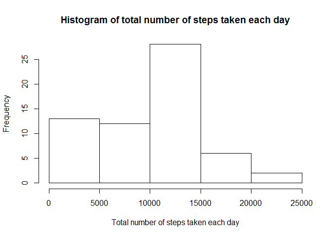

# Reproducible Research: Peer Assessment 1

**Loading and preprocessing the data**


```r
unzip("activity.zip", "activity.csv")
dt <- read.csv("activity.csv")
```

**What is mean total number of steps taken per day?**


```r
stepsbyday <- xtabs(steps ~ date, data=dt)
hist(stepsbyday, main="Histogram of total number of steps taken each day", xlab="Total number of steps taken each day")
```

 

Mean and median of steps per day, excluding NAs:


```r
dtmean <- mean(dt$steps, na.rm=TRUE)
dtmean
```

```
## [1] 37.3826
```

```r
dtmedian <- median(dt$steps, na.rm=TRUE)
dtmedian
```

```
## [1] 0
```

**What is the average daily activity pattern?**


```r
avgsteps <- aggregate(steps ~ interval, data=dt, mean)
with(avgsteps, plot(interval, steps, type="l", main="Average number of steps taken per interval in a day"))
```

 

Interval with the maximum average steps taken per day:


```r
avgsteps$interval[which.max(avgsteps$steps)]
```

```
## [1] 835
```

**Imputing missing values**

Number of missing values (rows with NAs):

```r
sum(!complete.cases(dt))
```

```
## [1] 2304
```

Replace missing values with mean steps of the respective interval:


```r
dt1 <- dt
nacases <- which(!complete.cases(dt1))

for (i in nacases) {
   dt1[i,]$steps <- avgsteps$steps[avgsteps$interval == dt1[i,]$interval]
}

stepsbyday1 <- xtabs(steps ~ date, data=dt1)
hist(stepsbyday1, main="Histogram of total number of steps taken each day", xlab="Total number of steps taken each day")
```

 

```r
dtmean1 <- mean(dt1$steps, na.rm=TRUE)
dtmean1
```

```
## [1] 37.3826
```

```r
dtmean == dtmean1
```

```
## [1] TRUE
```

```r
dtmedian1 <- median(dt1$steps, na.rm=TRUE)
dtmedian1
```

```
## [1] 0
```

```r
dtmedian == dtmedian1
```

```
## [1] TRUE
```


```r
dtsum <- sum(dt$steps, na.rm=TRUE)
dtsum
```

```
## [1] 570608
```

```r
dtsum1 <- sum(dt1$steps, na.rm=TRUE)
dtsum1
```

```
## [1] 656737.5
```

```r
dtsum < dtsum1
```

```
## [1] TRUE
```

**Are there differences in activity patterns between weekdays and weekends?**

Add column for whether day is weekday or weekend:


```r
wd <- weekdays(strptime(dt1$date, "%Y-%m-%d"))
dt1$weekday <- ifelse(wd == "Saturday" | wd == "Sunday", "weekend", "weekday")
dt1$weekday <- as.factor(dt1$weekday)
```

Differences in activity patterns between weekdays and weekends:


```r
avgsteps_wd <- aggregate(steps ~ interval, data=subset(dt1, dt1$weekday == "weekday"), mean)
avgsteps_we <- aggregate(steps ~ interval, data=subset(dt1, dt1$weekday == "weekend"), mean)

f <- rep(0:1, each=nrow(avgsteps_wd))
f <- factor(f, labels=c("weekday", "weekend"))

library(lattice)
xyplot(steps ~ interval | f, data=rbind(avgsteps_wd, avgsteps_we), layout=c(1,2), type="l", ylab="Number of steps", xlab="Interval")
```

 

